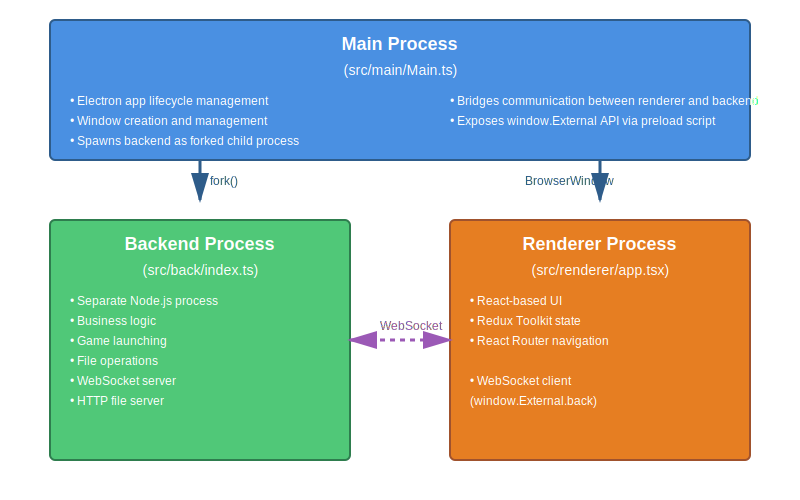
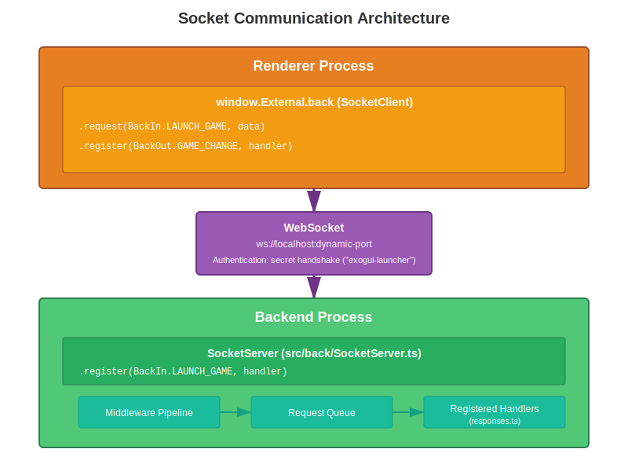

# exogui Architecture

This document provides a detailed overview of the exogui launcher architecture, with a focus on the socket-based communication system between processes.

## Table of Contents

- [Process Architecture](#process-architecture)
- [Socket Communication](#socket-communication)
- [Message Types Reference](#message-types-reference)
- [Data Flow](#data-flow)
- [Game Loading and Launching](#game-loading-and-launching)

## Process Architecture

exogui uses a **three-process architecture** based on Electron:



### Main Process (`src/main/`)

**Entry Point:** `src/main/index.ts` → `Main.ts`

**Responsibilities:**
- Manages Electron application lifecycle
- Creates and configures BrowserWindow instances
- Forks backend process as a child process
- Loads config.json and preferences.json
- Provides `window.External` API to renderer via preload script (`MainWindowPreload.ts`)
- Acts as a bridge for some IPC operations (dialogs, external links)

### Backend Process (`src/back/`)

**Entry Point:** `src/back/index.ts`

**Responsibilities:**
- Runs as a **separate forked Node.js process** (not Electron)
- Handles all business logic: game loading, launching, playlist management
- Runs WebSocket server on dynamic port (range: `backPortMin` - `backPortMax`)
- Runs HTTP file server for static assets (images, videos) on dynamic port (`imagesPortMin` - `imagesPortMax`)
- Manages game processes via Node.js `child_process`
- Watches filesystem for game installation changes (using Chokidar)

**Key Modules:**
- `SocketServer.ts` - WebSocket server for communication
- `GameLauncher.ts` - Game execution logic
- `PlaylistManager.ts` - Playlist CRUD operations
- `backend/fileServer.ts` - Static file HTTP server
- `responses.ts` - Request handler registration
- `VlcPlayer.ts` - Background music playback

### Renderer Process (`src/renderer/`)

**Entry Point:** `src/renderer/index.tsx` → `app.tsx`

**Responsibilities:**
- React-based user interface
- Redux Toolkit for state management
- React Router for page navigation
- Communicates with backend via WebSocket (`window.External.back`)
- Displays games, playlists, search results
- All games loaded into memory for client-side filtering/searching

### Shared Code (`src/shared/`)

Contains TypeScript types, interfaces, and utilities shared across all processes:
- Socket communication types (`back/types.ts`, `socket/`)
- Game interfaces and parsers (`game/`)
- Configuration and preferences structures (`config/`, `preferences/`)
- Command mapping utilities (`mappings/`)

## Socket Communication

exogui uses a **custom WebSocket-based communication layer** instead of Electron's standard IPC. This allows the backend to run as a separate process and enables potential future remote access.

### Architecture



### Connection Establishment

1. **Backend starts** and binds to an available port in range `backPortMin` - `backPortMax`
2. **Backend sends port number** to main process via process messaging
3. **Main process** stores the port and passes it to renderer during initialization
4. **Renderer connects** to `ws://localhost:<port>` on startup
5. **Authentication handshake** using secret string ("exogui-launcher")
6. **Connection established**, both sides can now send messages

### Message Structure

All messages are wrapped in a standardized format:

**Request (Renderer → Backend):**
```typescript
type WrappedRequest<T> = {
  id: string;           // UUID for request/response matching
  type: BackIn;         // Request type enum
  data?: T;             // Optional request payload
}
```

**Response (Backend → Renderer):**
```typescript
type WrappedResponse<T> = {
  id: string;           // Matches request ID
  type: BackOut;        // Response type enum
  data?: T;             // Optional response payload
}
```

### Communication Patterns

#### 1. Request/Response Pattern

Used for synchronous operations where the renderer expects a response.

**Example: Get playlists**
```typescript
// Renderer
const playlists = await window.External.back.request(BackIn.GET_PLAYLISTS);

// Backend (in responses.ts)
registerRequestHandler(
  state,
  BackIn.GET_PLAYLISTS,
  async () => {
    return state.playlistManager.getPlaylists();
  }
);
```

#### 2. Broadcast Pattern

Used for state changes where the backend notifies the renderer without a prior request.

**Example: Game changed**
```typescript
// Backend
state.socketServer.broadcast(BackOut.GAME_CHANGE, updatedGame);

// Renderer
window.External.back.register(BackOut.GAME_CHANGE, (game: IGameInfo) => {
  // Update Redux store
  dispatch(updateGame(game));
});
```

#### 3. Fire-and-Forget Pattern

Used for commands that don't require a response.

**Example: Add log entry**
```typescript
// Renderer
window.External.back.send(BackIn.ADD_LOG, {
  source: 'Renderer',
  content: 'Game launched'
});
```

### Key Features

**Request Queue:**
- Backend processes requests sequentially to avoid race conditions
- Ensures consistent state during complex operations

**Middleware Pipeline:**
- Requests pass through middleware for logging, validation, etc.
- Defined in `SocketServerMiddleware.ts`

**Type Safety:**
- `BackInTemplate` and `BackOutTemplate` provide type-safe message definitions
- TypeScript enforces correct payload types for each message

**Auto-Reconnection:**
- Renderer automatically attempts to reconnect if connection is lost
- Configurable retry logic with exponential backoff

**Multiple Clients:**
- Backend can handle multiple renderer connections (for future multi-window support)

## Message Types Reference

### BackIn (Requests TO Backend)

Messages sent from renderer to backend:

| Message Type | Payload | Response | Description |
|-------------|---------|----------|-------------|
| `INIT_LISTEN` | - | `BackInit[]` | Initialize backend listeners |
| `GET_RENDERER_INIT_DATA` | - | `GetRendererInitDataResponse` | Get config, preferences, playlists, themes, etc. |
| `GET_PLAYLISTS` | - | `GamePlaylist[]` | Get all playlists |
| `LAUNCH_GAME` | `{game, addApps}` | - | Launch a game with additional applications |
| `LAUNCH_GAME_SETUP` | `{game, addApps}` | - | Launch game setup program |
| `LAUNCH_ADDAPP` | `{game, addApp}` | - | Launch an additional application (manual, etc.) |
| `LAUNCH_COMMAND` | `filePath: string` | - | Execute a command/script |
| `GET_GAME` | `{id}` | `{game, addApps}` | Get game by ID |
| `GET_ALL_GAMES` | - | `{games}` | Get all games (rarely used) |
| `RANDOM_GAMES` | `{count}` | `IGameInfo[]` | Get random games |
| `SAVE_GAME` | `IGameInfo` | - | Save game changes |
| `UPDATE_CONFIG` | `Partial<IAppConfigData>` | - | Update configuration |
| `UPDATE_PREFERENCES` | `IAppPreferencesData` | - | Update user preferences |
| `ADD_LOG` | `ILogPreEntry` | - | Add log entry |
| `PLAY_AUDIO_FILE` | `filePath: string` | - | Play background music |
| `TOGGLE_MUSIC` | `newState: boolean` | - | Start/stop music |
| `SET_VOLUME` | `volume: number` | - | Set music volume |
| `SET_LOCALE` | `localeCode: string` | - | Change language |
| `QUIT` | - | - | Quit application |

### BackOut (Messages FROM Backend)

Messages sent from backend to renderer:

| Message Type | Payload | Description |
|-------------|---------|-------------|
| `INIT_EVENT` | `{done: BackInit[]}` | Initialization completed |
| `GAME_CHANGE` | `IGameInfo` | Game data updated |
| `PLAYLIST_UPDATE` | `GamePlaylist` | Playlist added/modified |
| `PLAYLIST_REMOVE` | `filename: string` | Playlist deleted |
| `LOG_ENTRY_ADDED` | `{entry, index}` | New log entry |
| `THEME_CHANGE` | `themeName: string` | Active theme changed |
| `THEME_LIST_CHANGE` | `Theme[]` | Available themes changed |
| `UPDATE_PREFERENCES_RESPONSE` | `IAppPreferencesData` | Preferences updated |
| `OPEN_DIALOG` | `MessageBoxOptions` | Request to show dialog |
| `OPEN_EXTERNAL` | `{url, options}` | Request to open external URL |
| `LOCALE_UPDATE` | `localeCode: string` | Language changed |

### Common Data Types

**GetRendererInitDataResponse:**
```typescript
{
  config: IAppConfigData;
  preferences: IAppPreferencesData;
  commandMappings: IAppCommandsMappingData;
  fileServerPort: number;
  log: ILogEntry[];
  themes: Theme[];
  playlists?: GamePlaylist[];
  localeCode: string;
}
```

**IGameInfo:**
```typescript
{
  id: string;
  title: string;
  platform: string;
  developer: string;
  publisher: string;
  releaseDate: string;
  applicationPath: string;
  commandLine: string;
  // ... and many more fields
}
```

## Data Flow

### Application Initialization

```
1. Main Process starts
   └─► Reads config.json and preferences.json
   └─► Forks Backend Process
       └─► Backend initializes:
           - Loads config, preferences
           - Starts SocketServer on available port
           - Starts FileServer on available port
           - Initializes PlaylistManager
           - Sends port numbers to Main Process
   └─► Creates Renderer Window
       └─► Renderer loads:
           - Connects to Backend via WebSocket
           - Sends GET_RENDERER_INIT_DATA request
           - Receives config, preferences, playlists, themes
           - Initializes Redux store
           - Starts reading game XML files
           - Parses XML → IGameInfo objects
           - Populates gamesSlice in Redux
           - Creates filesystem watchers
```

### Game Launch Flow

```
1. User clicks "Launch Game" in UI
   │
2. Renderer sends BackIn.LAUNCH_GAME
   │ payload: {game: IGameInfo, addApps: IAdditionalApplicationInfo[]}
   │
3. Backend receives request → GameLauncher.launchGame()
   │
4. GameLauncher:
   ├─► Resolves applicationPath (handles platform-specific paths)
   ├─► Applies execMappings (platform-specific executable substitutions)
   ├─► Creates command via CommandMapping
   │   └─► Converts .bat → .command on Unix
   ├─► Handles AutoRunBefore additional applications
   ├─► Stops VLC music player if playing
   ├─► Spawns child process with game command
   │   └─► Logs stdout/stderr
   └─► Returns to renderer
```

### Game Data Loading Flow

```
1. Renderer initialization complete
   │
2. gamesMiddleware detects initialization
   │
3. Read Platforms.xml from platformFolderPath
   │ └─► List of platforms (MS-DOS, Win3x, etc.)
   │
4. For each platform:
   ├─► Read <Platform>.xml (e.g., MS-DOS.xml)
   ├─► Parse XML using fast-xml-parser
   ├─► Transform to IGameInfo via GameParser.parse()
   │   ├─► Normalize paths
   │   ├─► Parse dates
   │   ├─► Map media files
   │   └─► Determine installation status
   ├─► Dispatch setGames() to Redux
   │
5. Create file watchers for game directories
   └─► Watch for installation/uninstallation changes
       └─► Update game.installed status
```

### Search and Filter Flow

```
1. User types in search box or applies filters
   │
2. Dispatch search action to searchSlice
   │
3. searchMiddleware intercepts action
   │
4. Filter games in memory (client-side):
   ├─► Text search across title, developer, publisher
   ├─► Apply platform filter
   ├─► Apply playlist filter
   ├─► Apply advanced filters (year, genre, etc.)
   └─► Sort by selected criteria
   │
5. Update searchSlice with filtered results
   │
6. UI re-renders with new game list (via React-Redux)
```

**Note:** All search and filtering is **client-side**. The backend is not involved. This is possible because all games (even 7000+ in eXoDOS) fit in memory and React-Virtualized handles efficient rendering.

## Game Loading and Launching

### LaunchBox XML Format

exogui reads LaunchBox-format XML files:

**Platforms.xml:**
```xml
<LaunchBox>
  <Platform>
    <Name>MS-DOS</Name>
  </Platform>
  <Platform>
    <Name>Windows 3.x</Name>
  </Platform>
</LaunchBox>
```

**MS-DOS.xml (example):**
```xml
<LaunchBox>
  <Game>
    <Title>Prince of Persia</Title>
    <ApplicationPath>!dos\Prince\PRINCE.BAT</ApplicationPath>
    <CommandLine></CommandLine>
    <Developer>Brøderbund</Developer>
    <ReleaseDate>1989-10-03</ReleaseDate>
    <!-- ... more fields ... -->
  </Game>
  <AdditionalApplication>
    <GameID>12345</GameID>
    <Name>Manual</Name>
    <ApplicationPath>!dos\Prince\Manual.pdf</ApplicationPath>
    <AutoRunBefore>false</AutoRunBefore>
  </AdditionalApplication>
</LaunchBox>
```

### Game Launching Mechanism

**1. Path Resolution**

Paths in LaunchBox XML are relative to `exodosPath`:
```
applicationPath: "!dos\Prince\PRINCE.BAT"
exodosPath: "/home/user/eXoDOS"
resolvedPath: "/home/user/eXoDOS/!dos/Prince/PRINCE.BAT"
```

**2. Exec Mappings**

Platform-specific executable substitutions (from `mappings.json`):
```json
{
  "win32": {
    "DOSBox": "eXoDOS/DOSBox/DOSBox.exe"
  },
  "linux": {
    "DOSBox": "eXoDOS/DOSBox/dosbox"
  }
}
```

**3. Command Mappings**

Converts Windows commands to Unix equivalents:
- `.bat` → `.command` on Unix
- Handles working directory and command line arguments

**4. Process Execution**

Uses Node.js `child_process.exec()`:
```typescript
const proc = exec(command, {
  cwd: workingDirectory,
  env: process.env
});

proc.stdout.on('data', (data) => log(data));
proc.stderr.on('data', (data) => log(data));
```

### File Server

The backend runs an HTTP file server for static assets:

```
http://localhost:<imagesPort>/<relativePath>
```

This serves:
- Game screenshots (`imageFolderPath`)
- Game logos (`logoFolderPath`)
- Videos, manuals, etc.

The renderer accesses these via standard `` tags and video players.

---

## Architecture Benefits

1. **Process Isolation**: Backend crashes don't affect UI; can be restarted independently
2. **Type Safety**: TypeScript enforces correct message types and payloads
3. **Scalability**: Socket-based communication allows future remote access
4. **Testability**: Backend can be tested independently without Electron
5. **Performance**: Client-side filtering handles large datasets efficiently
6. **Cross-Platform**: Platform abstractions (exec mappings, command mappings) handle OS differences

## Key Files Reference

- **Socket Communication:**
  - `src/shared/back/SocketClient.ts` - Client-side socket wrapper
  - `src/back/SocketServer.ts` - Server-side socket implementation
  - `src/shared/back/types.ts` - Message type definitions
  - `src/back/responses.ts` - Request handler registration

- **Game Management:**
  - `src/back/game/GameLauncher.ts` - Game execution
  - `src/shared/game/GameParser.ts` - XML parsing
  - `src/back/game/LaunchBoxHelper.ts` - LaunchBox format handling

- **State Management:**
  - `src/renderer/redux/gamesSlice.ts` - Games state
  - `src/renderer/redux/searchSlice.ts` - Search/filter state
  - `src/renderer/redux/gamesMiddleware.ts` - Game loading logic

- **Configuration:**
  - `config.json` - Application configuration (see [config.md](config.md))
  - `preferences.json` - User preferences
  - `mappings.json` - Platform-specific executable mappings
